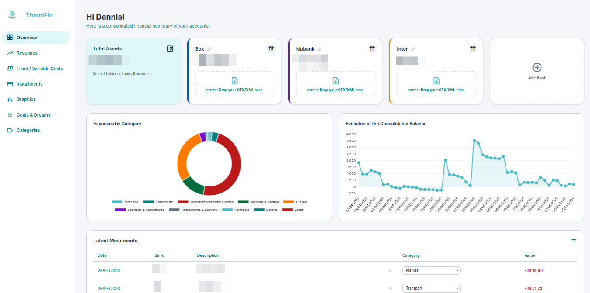
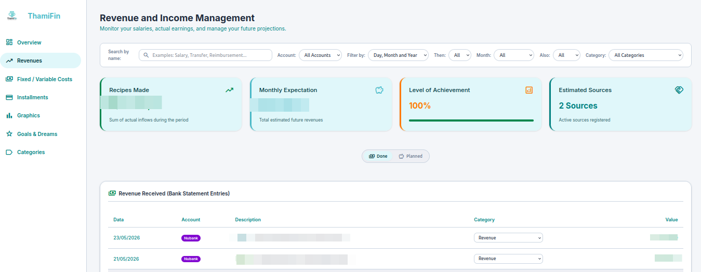
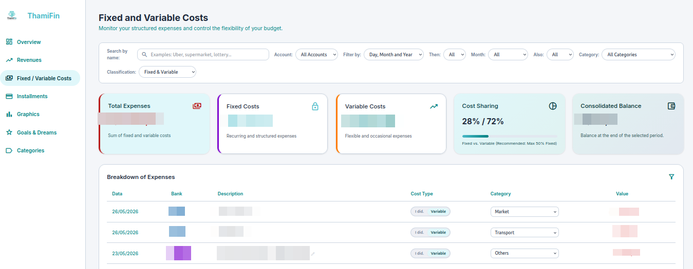

# ThamiFin - Personal Finance Manager

ThamiFin is a web-based personal finance application built with FastAPI and SQLAlchemy. It allows users to track their bank accounts, import transactions via OFX files, manage installment plans, and project future financial scenarios.

## Features

- **Transaction Management**: Import bank statements in OFX format with built-in duplicate detection using unique transaction hashes.
- **Automated Categorization**: Transactions are automatically categorized based on descriptions and learned user rules.
- **Dashboard**: Overview of account balances, recent activities, and consolidated financial health.
- **Fixed vs. Variable Costs**: Distinguish between recurring obligations and variable spending to better understand consumption patterns.
- **Installment Tracking**: Link real transactions to specific installment plans (e.g., credit card purchases) to track progress and remaining balances.
- **Future Projections**: Simulate financial status for the next 24 months based on historical averages, recurring income, and active installment plans.
- **Financial Goals**: Set and monitor progress towards specific savings or purchase objectives.
- **Security**: Authentication powered by JWT with HTTP-only cookies and bcrypt password hashing.

## Tech Stack

- **Backend**: Python 3.x, FastAPI
- **Database**: SQLite with SQLAlchemy ORM
- **Templating**: Jinja2
- **Frontend**: Vanilla JavaScript and CSS
- **Data Parsing**: ofxparse for bank statement processing

## Installation

1. Clone the repository:
   ```bash
   git clone https://github.com/yourusername/thamifin-Personal-Finances-App.git
   cd thamifin-Personal-Finances-App
   ```

2. Create a virtual environment and activate it:
   ```bash
   python -m venv venv
   source venv/bin/activate  # On Windows: venv\Scripts\activate
   ```

3. Install the dependencies:
   ```bash
   pip install -r requirements.txt
   ```

## Usage

1. Initialize the database and start the server:
   ```bash
   python main.py
   ```

2. Access the application at `http://127.0.0.1:8000`.

3. Use the default credentials (if seeded) or check `main.py` for the initial user configuration.

## Project Structure

- `main.py`: Application entry point, routes, and core logic.
- `database.py`: Database models and connection configuration.
- `auth.py`: Security and authentication utilities.
- `ofx_parser.py`: Logic for processing bank statement files.
- `static/`: Frontend assets (CSS and JavaScript).
- `templates/`: HTML templates for different views.

## License

This project is licensed under the MIT License - see the [LICENSE](LICENSE) file for details.

## Dashboard


## Revenue


## Costs


